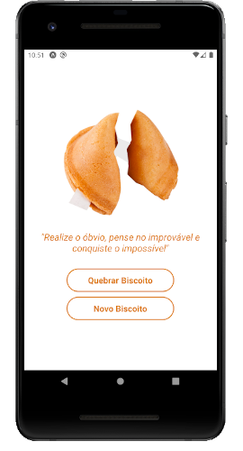

# Biscoito da Sorte - React Native

## Sobre
Projeto baseado em estudos.
Este simples aplicativo tem o objetivo de exibir frases aleatórias para um biscoito da sorte.

## Instalador
Você pode instalar esse aplicativo em modo de produção pelo link abaixo:
   * Instalador Android - arquivo .apk - https://drive.google.com/file/d/19nW1f9HKiJbpFE2fdgO5WMhrHMRx4W1E/view?usp=sharing

## Tecnologias utilizadas
* React Native
* Expo

## Executando o projeto
**Pré-requisitos:** Para executar este projeto em modo de desenvolvimento, você precisará ter o Expo e o Node instalados em seu computador.

*Para mais informações consulte a documentação oficial em:*

*https://docs.expo.io/get-started/installation*

*https://nodejs.org/en/download/package-manager*

**Clonando o Repositório**
~~~
$ git clone https://github.com/evertonpessoaramon/biscoitodasorte-reactnative.git
$ cd biscoitodasorte-reactnative
~~~

**Instalando dependências**
~~~
$ yarn install
~~~
ou
~~~
$ npm install
~~~

**Executando o projeto**
~~~
$ expo start
~~~
